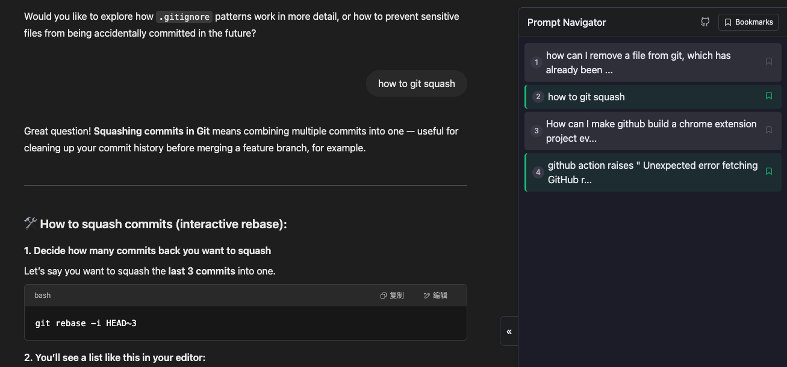

# ChatGPT Navigator

A browser extension that adds a navigation panel to ChatGPT, showing links to all your prompts in the conversation.



## Features

- 📋 Automatically indexes all user prompts in the current ChatGPT conversation
- 🔍 Quick navigation to any prompt with a single click
- 📱 Responsive design that works on both desktop and mobile
- 🌓 Supports both light and dark themes
- 📏 Adjustable panel width via drag handle
- 🔖 Bookmark important prompts for quick access
- 🔄 Toggle panel visibility with a single click

## Installation

1. Download the latest release from the [Releases page](https://github.com/cuckon/gpt-nav/releases)
2. Unzip the downloaded file
3. In Chrome, go to `chrome://extensions/`
4. Enable "Developer mode" (toggle in the top-right corner)
5. Click "Load unpacked" and select the unzipped folder
6. The extension is now installed and will be active on ChatGPT

## Development

### Making Changes

1. Clone the repository
2. Make your changes to the code
3. Test the extension locally by loading it as an unpacked extension

### Creating a Release

This repository uses GitHub Actions to automatically build and release the extension when a new tag is pushed.

To create a new release:

1. Update the version number in `manifest.json`
2. Commit your changes and push to the repository
3. Create and push a new tag with the version number:

```bash
git tag v0.1.1.0
git push origin v0.1.1.0
```

GitHub Actions will automatically:
- Build the extension
- Create a ZIP file
- Create a new release with the ZIP file attached

## License

This project is licensed under the MIT License - see the [LICENSE](LICENSE) file for details. 